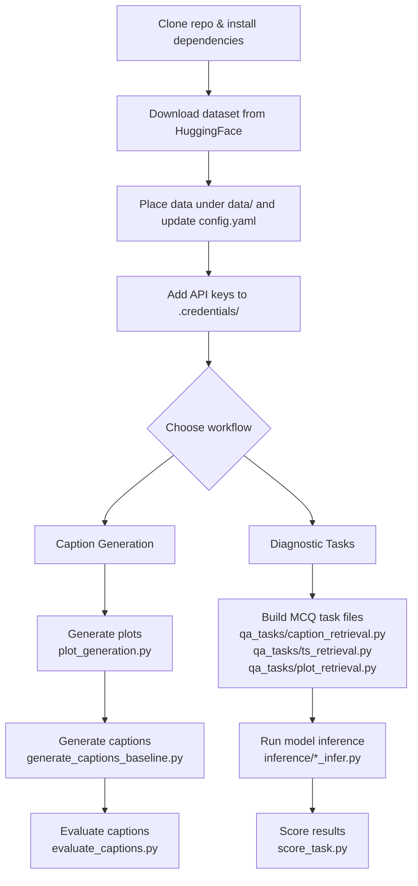

# CaTS-Bench: Can Language Models Describe Time Series?

**Findings of ACL 2026** | [Paper](https://arxiv.org/abs/2509.20823) | [Dataset](https://huggingface.co/datasets/mhfisher/CaTSBench)

> *Luca Zhou, Pratham Yashwante, Marshall Fisher, Alessio Sampieri, Zihao Zhou, Fabio Galasso, Rose Yu*

---

## Abstract

Time series captioning, the task of describing time series in natural language, requires numeric and temporal reasoning, trend interpretation, and contextual understanding. Existing benchmarks, however, often rely on fully synthetic or generic captions, and typically neglect metadata and visual representations. We introduce **CaTS-Bench**, a comprehensive benchmark for **C**ontext-**a**ware **T**ime **S**eries reasoning across 11 diverse domains, centered on a gold-standard evaluation set of 1,746 human-rewritten captions that measure how effectively models translate numeric trends into immediately interpretable narratives. To address the scarcity of human-annotated data, we also propose a scalable pipeline for generating high-fidelity synthetic captions. We evaluate leading Vision-Language Models on our benchmark, revealing that even proprietary models struggle to capture numeric nuances in temporal descriptions, while finetuning open-source models on synthetic data yields substantial performance gains. Finally, we release a diagnostic suite of 910 multiple-choice questions and tailored numeric metrics to gauge time-series-specific reasoning capabilities.

---

## Repository Structure

```
source/
├── configs/
│   └── config.yaml                  # Central configuration (models, paths, eval settings)
├── inference/                       # Local model inference scripts
│   ├── llava_infer.py
│   ├── internvl_infer.py
│   ├── phi4_infer.py
│   ├── base_qwen_infer.py
│   ├── fine_tuned_qwen_infer.py
│   ├── dsmath_infer.py
│   └── inference_utils.py
├── qa_tasks/                        # Diagnostic task generation
│   ├── caption_retrieval.py
│   ├── ts_retrieval.py
│   ├── plot_retrieval.py
│   ├── perturbed_caption_retrieval.py
│   ├── perturbed_ts_retrieval.py
│   └── task_helpers.py
├── helpers.py                       # Core utilities: API calls, metrics (BLEU, ROUGE, BERTScore, SimCSE)
├── generate_captions_baseline.py    # Caption generation via API/local VLMs
├── evaluate_captions.py             # Full evaluation (text similarity + numeric accuracy)
├── evaluate_captions_stat_inf_only.py  # Numeric accuracy evaluation only
├── auto_script.py                   # Generation with exponential backoff retry
├── plot_generation.py               # Generate time series plots (JPEG)
├── paraphrase_captions.py           # Synthetic caption augmentation
├── mix_captions.py                  # Caption mixing utilities
├── qwen_fine_tune.py                # Fine-tuning Qwen on synthetic captions
├── simcse.py                        # SimCSE semantic similarity
└── multi_gpu_utils.py               # Multi-GPU batch processing
data/
└── processed/                       # Source time series data (11 domains, JSON format)
run_evaluations_batch.sh             # Sequential evaluation across all models
run_evaluations_tmux.sh              # Parallel evaluation across GPUs (tmux)
```

---

## Domains

CaTS-Bench covers 11 diverse real-world time series domains:

| Domain | File |
|--------|------|
| Air Quality | `aq.json` *(available on HuggingFace — too large for GitHub)* |
| Agricultural Productivity | `agricultural_productivity.json` |
| Border Crossing | `border_crossing.json` |
| CO₂ Emissions | `co2.json` |
| COVID-19 | `covid.json` |
| Crime Statistics | `crime.json` |
| Demographics | `demographics.json` |
| Diet | `diet.json` |
| Online Retail | `online_retail.json` |
| Road Injuries | `road_injuries.json` |
| Walmart Sales | `walmart.json` |

---

## Installation

```bash
git clone https://github.com/LuckerZOfficiaL/CaTS-Bench.git
cd CaTS-Bench
pip install -r requirements.txt
```

---

## Setup

### 1. Data

Download the dataset from HuggingFace and place it under a `data/` folder in the repo root:

```
data/
├── time series/       # raw .csv time series files
├── plots/             # generated plot images (.jpeg)
├── gt_captions/       # ground-truth caption .txt files
├── generated_captions/ # model-generated caption .txt files (output)
└── metadata/          # per-series metadata .json files
```

Update the paths in [`source/configs/config.yaml`](source/configs/config.yaml) to point to your local `data/` subfolders.

### 2. API Credentials

Create a `.credentials/` directory in the repo root. Each file should contain only your API key as plain text (no quotes, no newlines):

```
.credentials/
├── openai    # your OpenAI API key
└── google    # your Google API key
```

For **Anthropic Claude via AWS Bedrock**, configure your AWS credentials in `~/.aws/credentials` as usual.

---

## Workflow



---

## Usage

### Generate captions

```bash
# Configure model.used_models and paths in source/configs/config.yaml first
python source/generate_captions_baseline.py

# With automatic retry on API failures
python source/auto_script.py
```

### Evaluate captions

```bash
# Full evaluation: text similarity + numeric accuracy
# Paths can be passed as args or set in config.yaml
python source/evaluate_captions.py \
  --generated_captions_folder_path data/generated_captions/<model_name> \
  --gt_captions_folder_path data/gt_captions

# Numeric accuracy only (min/max/mean/std)
python source/evaluate_captions_stat_inf_only.py \
  --generated_captions_folder_path data/generated_captions/<model_name> \
  --gt_captions_folder_path data/gt_captions

# Run all models sequentially
bash run_evaluations_batch.sh

# Run all models in parallel across GPUs
bash run_evaluations_tmux.sh
```

### Generate diagnostic tasks

```bash
# Update data_path inside each script to point to your data/
python -m source.qa_tasks.caption_retrieval
python -m source.qa_tasks.ts_retrieval
python -m source.qa_tasks.plot_retrieval
```

### Run local model inference

```bash
CUDA_VISIBLE_DEVICES=0 python -m source.inference.llava_infer
CUDA_VISIBLE_DEVICES=0 python -m source.inference.internvl_infer
CUDA_VISIBLE_DEVICES=0 python -m source.inference.phi4_infer
python -m source.inference.base_qwen_infer
python -m source.inference.fine_tuned_qwen_infer
python -m source.inference.dsmath_infer
```

### Fine-tune on synthetic captions

```bash
python source/qwen_fine_tune.py
```

---

## Citation

```bibtex
@article{zhou2025cats,
  title={CaTS-Bench: Can Language Models Describe Numeric Time Series?},
  author={Zhou, Luca and Yashwante, Pratham and Fisher, Marshall and Sampieri, Alessio and Zhou, Zihao and Galasso, Fabio and Yu, Rose},
  journal={arXiv preprint arXiv:2509.20823},
  year={2025}
}
```
